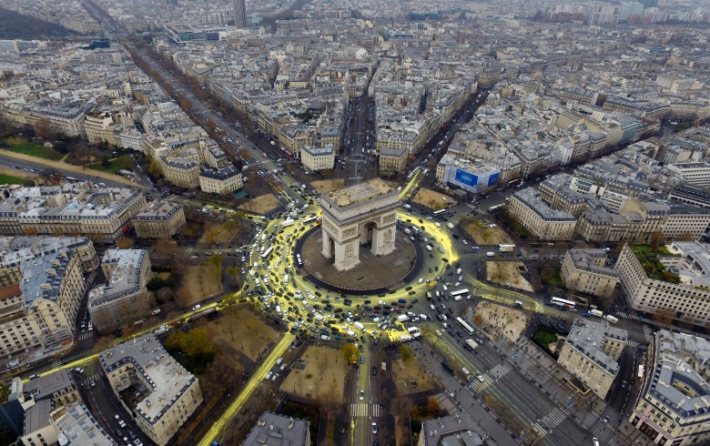
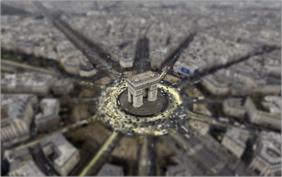

# 簡單圖片編輯器

## 支援瀏覽器
請使用新版 Firefox 或 Chrome

## 支援功能
* 開啟本地檔案或拖曳載入本地檔案進行編輯

* 自 URL 載入圖片進行編輯

* 景深效果: 選取對焦區域後，利用 canvas 對影像進行 image convolution，製造出景深效果，但基於 image CORS [1]，此效果不支援自 URL 載入之圖片

  [1] https://developer.mozilla.org/en-US/docs/Web/HTML/CORS_enabled_image

* Sepia(懷舊) 效果: 利用 CSS sepia filter 對影像進行動態 filtering 處理，當使用者選擇下載後，會利用 canvas 將效果併入圖片

* Grayscale(黑白) 效果: 利用 CSS grayscale filter 對影像進行動態 filtering 處理，當使用者選擇下載後，會利用 canvas 將效果併入圖片

* 剪裁圖片: 利用 canvas 與 CSS clip-path 對影像選取範圍進行剪裁

* 下載圖片: 使用者可下載處理後的圖片，但基於 image CORS，此效果不支援自 URL 載入之圖片

## 如何設定
1. 安裝 nodejs 與 yarn(非必要)

2. 下載此專案 repo: https://github.com/Fischer-L/image-edit

3. 到 repo 目錄下執行 `npm install` 或 `yarn install`

4. 執行 `npm start` 或 `yarn start`

5. 開啟 Firefox/Chrome 載入 `localhost:3000`

6. repo 目錄下 images 目錄內有 sample 圖片以及處理過的 demo 圖片可供使用，例如
  
  - 處理前

    
  
  - 處理後

    
  
  - 處理前

    
  
  - 處理後
  
    

7. 如遇到設定失敗問題，以下是本專案開發環境供參考:
  - MAC OS 10.12.6
  - node v9.4.0
  - yarn 1.3.2
  - npm 5.6.0
  